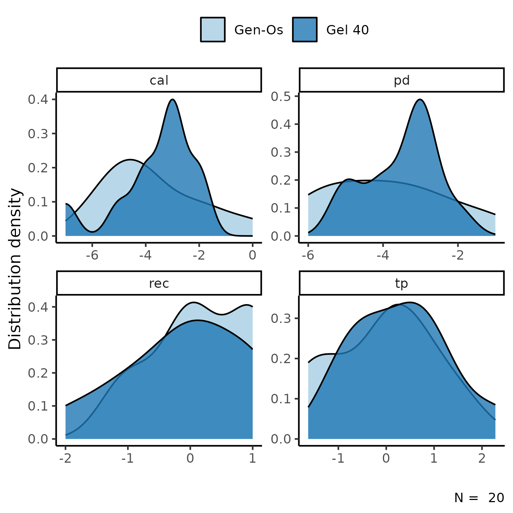
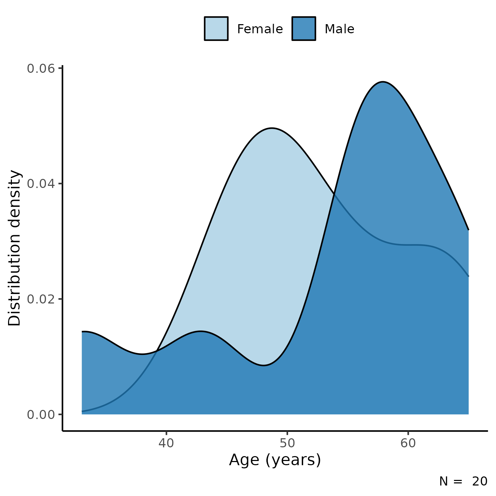

```{r setup, include=FALSE}
knitr::opts_chunk$set(echo = FALSE)
knitr::opts_knit$set(root.dir = normalizePath(".."))
options(scipen = 999)
library(pander)
library(knitr)
panderOptions('table.style', 'rmarkdown')
panderOptions('table.split.table', 160)
```

---

\newpage

**Non-inferiority of pre-hydrated collagenated xenogenic bone mix in periodontal intrabony defects: clinical trial**

**Document version**

```{r history}
Version <- c("01")
Changes <- c("Initial version")
history <- cbind(Version, Changes)
colnames(history) <- c("Version", "Alterations")
# pander(history, split.cells = 70)
kable(history)
```

```{r results, include=FALSE}
source("scripts/results.R", encoding = 'UTF-8')
```

---

# Abbreviations

# Context

## Objectives

<!-- ## Data reception and cleaning -->

# Methods

The data procedures, design and analysis methods used in this report are fully described in the annex document **SAP-2023-010-TK-v01**.

<!-- ## Study parameters -->

<!-- ### Study design -->

<!-- ### Inclusion and exclusion criteria -->

<!-- ### Exposures -->

<!-- ### Outcomes -->

<!-- ### Covariates -->

<!-- ## Statistical analyses -->

This analysis was performed using statistical software `R` version `r getRversion()`.

# Results

## Study population and follow up

In total, there were `r Nobs_final` participants included in the study, of which
`r inline_text(tab_desc, variable = gender, level = "Female")` were women (Table 1).
The average (SD) age of the study participant was
`r inline_text(tab_desc, variable = age)` years.

All baseline and end-of-study levels of the outcomes can be seen in Table 1.

```{r tab_desc}
tab_desc %>%
  as_kable(              # only for markdown
  # as_flex_table(       # only for DOCX
  # ) %>%
  # flextable::set_caption(
    caption = "**Table 1** Epidemiological and clinical characteristics of study participants."
  )
```

The distribution density of change in outcome levels can be seen in Figure 1.
The average change in CAL was slightly higher in the Gel 40 group when compared to Gen-Os group, but its distribution appears to be bi-modal.
This could be explained by the larger amount of participants in the lower range of REC change when compared to the Gen-Os group.

The PD change distribution appears slightly bi-modal in the Gel 40 group, and the average change was higher than the Gen-Os group.
The REC change appear to have similar averages in both groups, but as mentioned above the Gel 40 group has a heavier tail at the lower range of data.
The distributions of TP in both groups appear similar in center, width and shape.

```{r fig1, fig.cap="**Figure 1** Density distribution of study outcomes."}
# 
knitr::include_graphics("../figures/outcome.png", error = FALSE)
```

## Inferential analysis

```{r tab_inf}
tab_inf %>%
  as_kable(              # only for markdown
  # as_flex_table(       # only for DOCX
  # ) %>%
  # flextable::set_caption(
    caption = "**Table 2** caption"
  )
```

# Observations and Limitations

# Conclusions

# References

- **SAP-2023-010-TK-v01** -- Analytical Plan for Non-inferiority of pre-hydrated collagenated xenogenic bone mix in periodontal intrabony defects: clinical trial

# Appendix

## Exploratory data analysis

```{r A1, fig.cap="**Figure A1** Distribution of age in the study population."}
# 
knitr::include_graphics("../figures/distr_age.png", error = FALSE)
```

## Availability

All documents from this consultation were included in the consultant's Portfolio.

<!-- The client has requested that this analysis be kept confidential until a future date, determined by the client. -->
<!-- All documents from this consultation are therefore not published online and only the title and year of the analysis will be included in the consultant's Portfolio. -->
<!-- After the agreed date is reached, the documents will be released. -->

<!-- The client has requested that this analysis be kept confidential. -->
<!-- All documents from this consultation are therefore not published online and only the title and year of the analysis will be included in the consultant's Portfolio. -->

The portfolio is available at:

<https://philsf-biostat.github.io/SAR-2023-010-TK/>

## Analytical dataset

Table A1 shows the structure of the analytical dataset.

```{r data}
analytical_mockup %>%
  pander(caption = "**Table A1** Analytical dataset structure")
```

Due to confidentiality the data-set used in this analysis cannot be shared online in the public version of this report.
