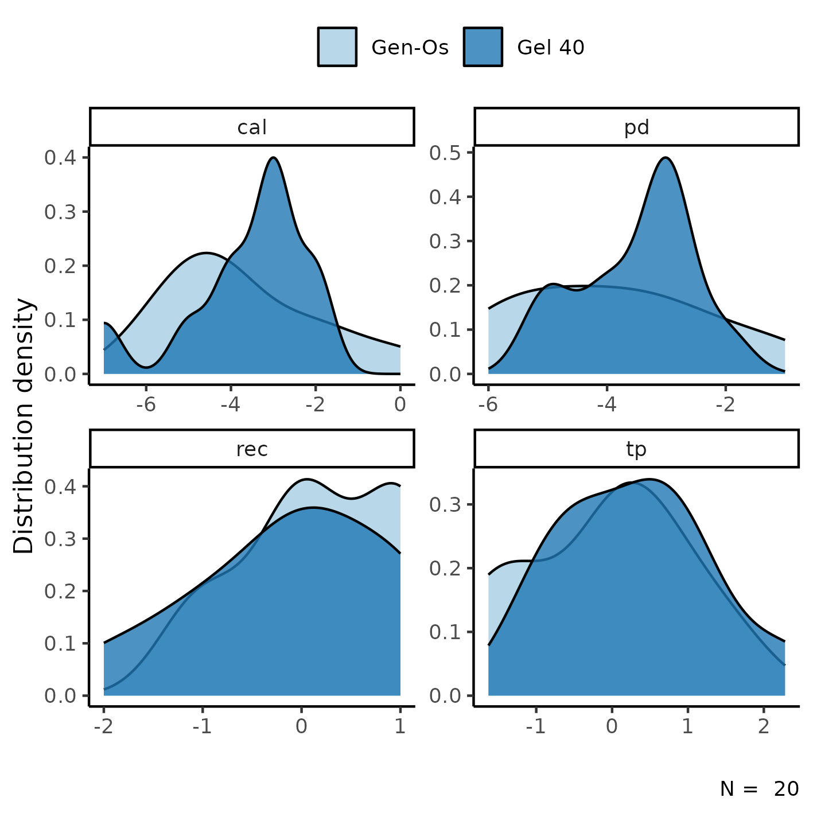
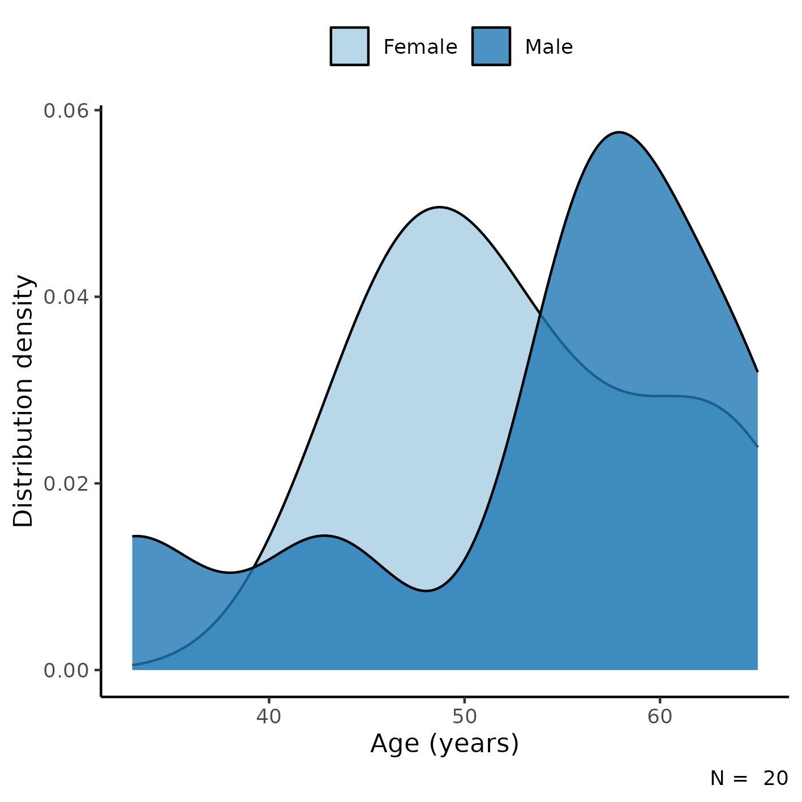

---

\newpage

**Non-inferiority of pre-hydrated collagenated xenogenic bone mix in periodontal intrabony defects: clinical trial**

**Document version**

|Version |Alterations     |
|:-------|:---------------|
|01      |Initial version |

---

# Abbreviations

- CAL: clinical attachment level
- CI: confidence interval
- d: Cohen's D effect size
- PD: probing depth
- REC: gingival recession
- TP: tip of the papillae
- SD: standard deviation

# Context

## Objectives

To evaluate the non-inferiority of using pre-hydrated collagenated xenogenic bone mix in periodontal intrabony defects.

<!-- ## Data reception and cleaning -->

# Methods

The data procedures, design and analysis methods used in this report are fully described in the annex document **SAP-2023-010-TK-v01**.

<!-- ## Study parameters -->

<!-- ### Study design -->

<!-- ### Inclusion and exclusion criteria -->

<!-- ### Exposures -->

<!-- ### Outcomes -->

<!-- ### Covariates -->

<!-- ## Statistical analyses -->

This analysis was performed using statistical software `R` version 4.2.1.

# Results

## Study population and follow up

In total, there were 20 participants included in the study, of which
12 (60%) were women (Table 1).
The average (SD) age of the study participant was
53 (9) years.

Overall baseline and end-of-study levels of the outcomes in the study sample can be seen in Table 1.

Table: **Table 1** Epidemiological and clinical characteristics of study participants.

|        **Characteristic**         | **N = 20**  |
|:---------------------------------:|:-----------:|
|      __Biomaterial, n (%)__       |             |
|              Gen-Os               |  10 (50%)   |
|              Gel 40               |  10 (50%)   |
|         __Gender, n (%)__         |             |
|              Female               |  12 (60%)   |
|               Male                |   8 (40%)   |
|    __Age (years), Mean (SD)__     |   53 (9)    |
|         __Tooth, n (%)__          |             |
|                11                 |   2 (10%)   |
|                12                 |  1 (5.0%)   |
|                13                 |  1 (5.0%)   |
|                15                 |  1 (5.0%)   |
|                21                 |   2 (10%)   |
|                32                 |  1 (5.0%)   |
|                33                 |  1 (5.0%)   |
|                35                 |  1 (5.0%)   |
|                36                 |  1 (5.0%)   |
|                43                 |   3 (15%)   |
|                44                 |  1 (5.0%)   |
|                45                 |   2 (10%)   |
|                46                 |   3 (15%)   |
|   __PD (baseline), Mean (SD)__    | 7.75 (1.52) |
| __PD (end-of-study), Mean (SD)__  | 4.05 (1.64) |
|   __TP (baseline), Mean (SD)__    |    6 (6)    |
| __TP (end-of-study), Mean (SD)__  |  6.0 (5.4)  |
|   __REC (baseline), Mean (SD)__   | 2.05 (1.28) |
| __REC (end-of-study), Mean (SD)__ | 2.10 (1.25) |
|   __CAL (baseline), Mean (SD)__   | 9.80 (1.96) |
| __CAL (end-of-study), Mean (SD)__ | 6.15 (2.01) |

The distribution density of change in outcome levels can be seen in Figure 1.
The center of change in CAL was slightly higher in the Gel 40 group when compared to Gen-Os group, but the variability in the Gen-Os group is much larger, as seen in the width of its distribution, and with a heavy tail towards higher values.
The distribution of CAL change in Gel 40 appears to be bi-modal, although its shape seems more well-defined with less variability around the center.
This could be a result of the larger amount of participants in the lower range of REC change when compared to the Gen-Os group.

**Figure 1** Density distribution of changes in study outcomes.

The PD change distribution appears slightly bi-modal in the Gel 40 group, and the average change was higher than the Gen-Os group, but this could be due to the small sample size (see Observations).
The REC change appear to have similar averages in both groups, but as mentioned above the Gel 40 group has a heavier tail at the lower range of data.
The distributions of TP in both groups appear similar in center, width and shape.

## Inferential analysis

The difference in outcome changes for both interventions can be seen in Table 2.
The average (SD) change in CAL was
-3.60 (1.51) mm in the Gel 40 group and
-3.70 (1.83) mm in the Gen-Os group
(p=0.895).
This translates to a standardized mean difference of d = -0.06
(95% CI: -0.94 to 0.82).

The standardized effect of treatment in change in REC was
d = 0.33
(95% CI: -0.55 to 1.2),
for PD it was d = -0.29
(95% CI: -1.2 to 0.59) and
d = -0.38
(95% CI: -1.3 to 0.51) in TP (Table 2).

Table: **Table 2** caption

|**Characteristic**        | **Gen-Os**, N = 10 | **Gel 40**, N = 10 | **d** |  **95% CI**   | **p-value** |
|:-------------------------|:------------------:|:------------------:|:-----:|:-------------:|:-----------:|
|__CAL change, Mean (SD)__ |    -3.70 (1.83)    |    -3.60 (1.51)    | -0.06 | -0.94 to 0.82 |    0.895    |
|__REC change, Mean (SD)__ |    0.20 (0.79)     |    -0.10 (0.99)    | 0.33  | -0.55 to 1.2  |    0.465    |
|__PD change, Mean (SD)__  |    -3.90 (1.66)    |    -3.50 (0.97)    | -0.29 | -1.2 to 0.59  |    0.522    |
|__TP change, Mean (SD)__  |    -0.08 (1.08)    |    0.32 (1.01)     | -0.38 | -1.3 to 0.51  |    0.404    |

The non-inferiority defined for this analysis was the lower range of the 95% CI being larger than d = 1.32.
All outcomes meet this criteria, so the non-inferiority of Gel 40 is proven in this sample.

# Observations and Limitations

**Small sample size**

The total sample size of this study is only 20 participants.
Cohen considered an effect size of d = 0.8 to be large, which means that this sample size is only able to detect very large clinical effects at the 5% level of significance.

**Recommended reporting guideline**

The adoption of the EQUATOR network (<http://www.equator-network.org/>) reporting guidelines have seen increasing adoption by scientific journals.
All clinical trials are recommended to be reported following the CONSORT guideline (Schulz K F, Altman D G, Moher D., 2010).

# Conclusions

The lower limit of the CI for the effect size of
CAL
change was
-0.94,
and thus the Gel 40 is non-inferior to Gen-Os.

The lower limit of the CI for the effect size of
REC, PD and TP
change were (respectively)
-0.55, -1.2 and -1.3
and thus the Gel 40 is non-inferior to Gen-Os for these outcomes.

# References

- **SAP-2023-010-TK-v01** -- Analytical Plan for Non-inferiority of pre-hydrated collagenated xenogenic bone mix in periodontal intrabony defects: clinical trial
- Schulz K F, Altman D G, Moher D. CONSORT 2010 Statement: updated guidelines for reporting parallel group randomised trials BMJ 2010; 340 :c332 (<https://doi.org/10.1136/bmj.c332>).

# Appendix

## Exploratory data analysis

**Figure A1** Distribution of age in the study population.

## Availability

All documents from this consultation were included in the consultant's Portfolio.

<!-- The client has requested that this analysis be kept confidential until a future date, determined by the client. -->
<!-- All documents from this consultation are therefore not published online and only the title and year of the analysis will be included in the consultant's Portfolio. -->
<!-- After the agreed date is reached, the documents will be released. -->

<!-- The client has requested that this analysis be kept confidential. -->
<!-- All documents from this consultation are therefore not published online and only the title and year of the analysis will be included in the consultant's Portfolio. -->

The portfolio is available at:

<https://philsf-biostat.github.io/SAR-2023-010-TK/>

## Analytical dataset

Table A1 shows the structure of the analytical dataset.

| id  | exposure | gender | age | tooth | pd0 | pd2 | tp0 | tp2 | rec0 | rec2 | cal0 | cal2 | outcome | pd | tp | rec |
|:---:|:--------:|:------:|:---:|:-----:|:---:|:---:|:---:|:---:|:----:|:----:|:----:|:----:|:-------:|:--:|:--:|:---:|
|  1  |          |        |     |       |     |     |     |     |      |      |      |      |         |    |    |     |
|  2  |          |        |     |       |     |     |     |     |      |      |      |      |         |    |    |     |
|  3  |          |        |     |       |     |     |     |     |      |      |      |      |         |    |    |     |
| ... |          |        |     |       |     |     |     |     |      |      |      |      |         |    |    |     |
|  N  |          |        |     |       |     |     |     |     |      |      |      |      |         |    |    |     |

Table: **Table A1** Analytical dataset structure

Due to confidentiality the data-set used in this analysis cannot be shared online in the public version of this report.
